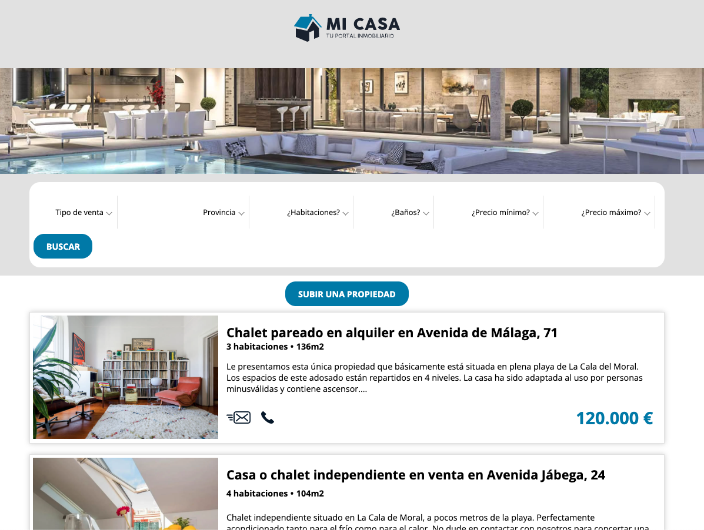
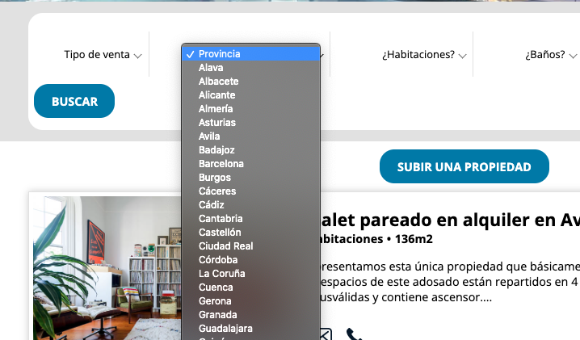
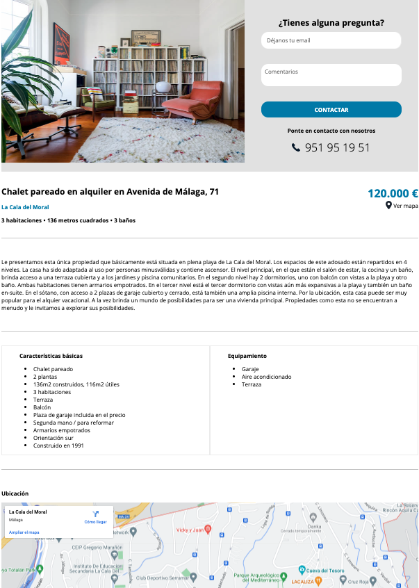
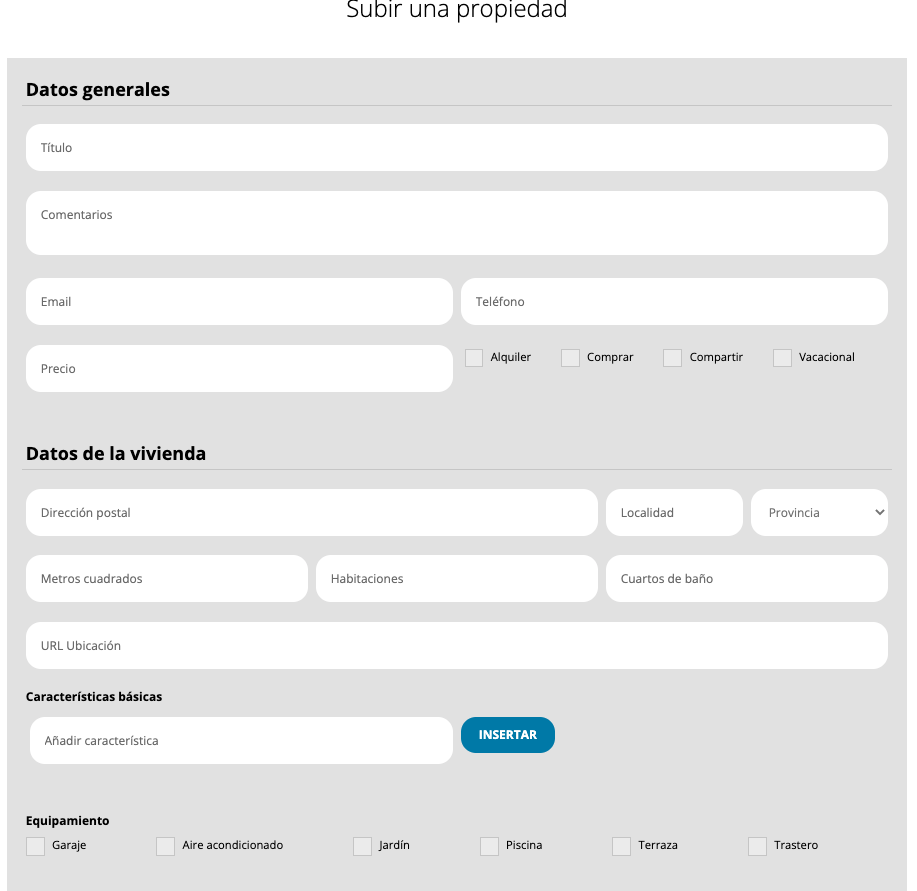

# Properties Excercise

This project has been developed with Javascript, HTML and CSS.

It has a server with a mocketed json to show the available properties. 

It has 3 different screens: 

1. List of preperties with different filters

2. Detail of the property

3. Upload a new property. it has a form to upload a new property to the platform, and then display it in the list with all its features.

Besides listing the available properties, 

The call and the post are made with Axios.
